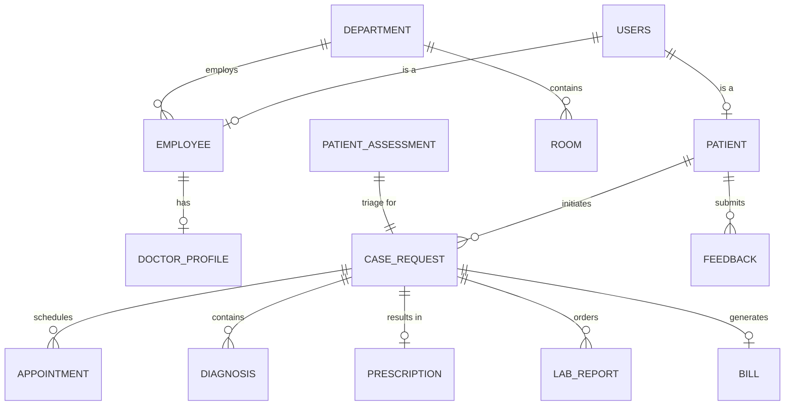

# DBMS Technical Audit & Implementation Report – Nexus Health

## 1. Purpose
This comprehensive report documents the Database Management System (DBMS) implementation for the **Nexus Health** (HMS Aarogya) project. It serves as dual-purpose documentation:
1.  **Academic Audit**: Demonstrating mastery of DBMS concepts like Normalization, ER Modeling, and ACID compliance.
2.  **Implementation Evidence**: Mapping specific SQL objects (Views, Functions, Triggers) to the backend API routes that utilize them.

---

## 2. Schema Design & Normalization
The database architecture follows strict relational design principles to ensure data integrity and minimize redundancy.

### 2.1 First Normal Form (1NF) — Atomicity
The schema ensures that all attributes contain atomic (indivisible) values and there are no repeating groups.
*   **Example**: In the `Patient` and `Employee` tables, names and addresses are decomposed into `FirstName`, `LastName`, `AddressLine1`, `City`, etc., rather than storing them as single concatenated strings.

### 2.2 Second Normal Form (2NF) — No Partial Dependencies
The schema ensures that all non-key attributes are fully functionally dependent on the entire primary key.
*   **Example**: In the `Diagnosis` table, which uses a composite primary key of `(CaseRequestID, DiseaseID)`, the `Notes` and `Severity` relate specifically to the *combination* of that case and disease.

### 2.3 Third Normal Form (3NF) — No Transitive Dependencies
The schema eliminates transitive dependencies; non-prime attributes depend only on the primary key.
*   **Example**: `CaseRequest` stores a `RoomID` reference rather than duplicating room details. Details like `RoomNumber` and `PricePerNight` belong strictly in the `Room` table.

### 2.4 Domain Integrity via Enums
Extensive use of PostgreSQL `ENUM` types (e.g., `blood_group`, `case_status`, `user_role`) ensures that only valid, predefined values are accepted at the database level.

---

## 3. Entity-Relationship (ER) Overview
The following diagram represents the core entities and their relationships within the Nexus Health system.

---

## 4. SQL Views (`vw_*`) — Data Abstraction
Views encapsulate complex joins and provide a simplified interface for the backend API.

| View Name | Backend Endpoint(s) | Purpose |
| :--- | :--- | :--- |
| `vw_open_cases_by_dept` | `GET /api/patients/assessments/pending` | Fetches untriaged cases for staff dashboards. |
| `vw_doctor_case_dashboard` | `GET /api/cases/:id` | Aggregates patient vitals, case status, and dept info for doctors. |
| `vw_doctor_diagnosis` | `GET /api/.../cases/:id` | Supplies structured diagnosis lists for Patient/Doctor UIs. |
| `vw_patient_lab_report` | `GET /api/.../lab-reports/:id` | Consolidates results, normal ranges, and units for patients. |
| `vw_patient_medical_history` | `GET /api/cases/patient/:id` | Provides a longitudinal EHR timeline for medical staff. |

---

## 5. Stored Functions & ACID Transactions (`fn_*`)
Critical business logic is encapsulated in stored functions to ensure **Atomicity** and **Consistency**.

| Function Name | Backend Route | Logic Encapsulated |
| :--- | :--- | :--- |
| `fn_register_patient` | `POST /api/patients` | Atomic user + patient creation with validation. |
| `fn_create_case_request` | `POST /api/patients/assessments` | Performs multi-table insert (Vitals + Case) in one transaction. |
| `fn_generate_bill` | `POST /api/billing/generate/:id` | Aggregates costs from Labs, Rooms, and Meds automatically. |
| `fn_accept_reject_case` | `PATCH /api/cases/:id/status` | Enforces state-machine transitions for clinical cases. |
| `fn_nurse_fill_lab_report` | `PATCH /api/lab-tests/:id` | Updates results and automatically marks reports as 'Resulted'. |

---

## 6. SQL Triggers (`trg_*`) — Automation
Triggers maintain data consistency and automate reactive tasks without backend intervention.

*   **`trg_prevent_double_booking`**: Prevents overlapping appointments for the same doctor/time slot.
*   **`trg_auto_complete_case`**: Automatically sets `Status = 'Resolved'` when a discharge date is recorded.
*   **`trg_calculate_bill`**: Recalculates `TotalAmount` whenever any line-item charge is modified.
*   **`trg_room_status`**: Synchronizes room occupancy with patient admission and discharge events.
*   **`trg_lab_result_time`**: Auto-fills the `ResultedOn` timestamp when a lab test is completed.
*   **`trg_notify_emergency`**: Inserts a high-priority system notification for newly created Emergency cases.

---

## 7. Performance Optimization (Indexes)
The following indexes ensure the system remains responsive as the dataset grows:

| Index Name | Table(Column) | Purpose |
| :--- | :--- | :--- |
| `idx_users_email_lower` | `users(Email)` | Unique index for fast, case-insensitive login lookups. |
| `idx_caserequest_status` | `CaseRequest(Status)`| Speeds up dashboard filtering for active cases. |
| `idx_appointment_date` | `Appointment(Date)` | Optimizes calendar retrieval for medical staff. |
| `idx_labreport_unbilled` | `LabReport(IsBilled)`| **Partial Index** (`WHERE IsBilled = FALSE`) for fast billing. |
| `idx_bill_caserequest` | `Bill(CaseRequestID)` | Optimizes financial record joins. |

---

## 8. Security & RBAC (Grants)
Role-Based Access Control is enforced at the database level to ensure data privacy:

*   **Admin**: Full privileges + execution rights on all administrative functions.
*   **Doctor**: Access limited to clinical views (`vw_doctor_*`) and diagnostic functions.
*   **Nurse**: Access to triage dashboards and lab result functions.
*   **Patient**: Restricted to personal records via filtered views; no access to other patients' data.

---

## 9. Conclusion
By shifting core logic to the DBMS layer via **Views, Functions, and Triggers**, Nexus Health ensures that data integrity and business rules are enforced at the source. This architecture provides a secure, high-performance foundation that is independent of the application layer.
